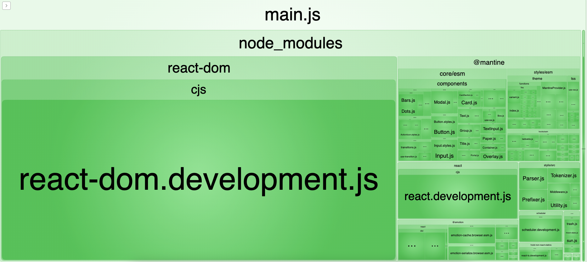
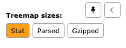

+++
title = 'Webpack Bundle Analyzer in React'
date = 2024-08-03
draft = false
image= 'webpack-bundle-analyzer-in-react-1.png'
+++
## Definition:
Webpack Bundle Analyzer is a tool used to visualize the contents of your Webpack bundle(s) to optimize the size and performance of your web application.

This analysis helps you identify which modules or assets are taking the most of the bundle size, allowing you to optimize your codebase. By understanding the dependencies and sizes of various modules, you can make informed decisions on code splitting, lazy loading, or removing unnecessary dependencies to improve load times and the application's overall performance.

## Usage:

1. Install webpack & webpack-cli 
```
npm i -D webpack webpack-cli webpack-bundle-analyzer
```

2. Setup **webpack.config.js** in the root of your app:
```js
const BundleAnalyzerPlugin =
 require("webpack-bundle-analyzer").BundleAnalyzerPlugin;

module.exports = {
 mode: "development", // or 'production'
 entry: "./src/index.js",
 module: {
  rules: [
   {
    test: /\.(js|jsx)$/,
    exclude: /node_modules/,
    use: {
     loader: "babel-loader",
     options: {
      presets: ["@babel/preset-env", "@babel/preset-react"],
     },
    },
   }
  ],
 },
 plugins: [new BundleAnalyzerPlugin()],
};
```

## Additional Configs:
To bundle CSS or SCSS you can add additional rules in your config:
```
{
  test: /\.css$/,
  use: ["style-loader", "css-loader"],
},
{
  test: /\.scss$/,
  use: ["style-loader", "css-loader", "sass-loader"],
}
```

3. Add “webpack” in your package.json scripts:

```
{
 "name": "todo_react_app",
 "version": "0.1.0",
 "private": true,
 "homepage": "https://javascriptbear.github.io/todo_react_app",
 "dependencies": {
  "@mantine/core": "^4.2.12",
  "@mantine/hooks": "^4.2.12",
  "@testing-library/jest-dom": "^5.16.4",
  "@testing-library/react": "^13.3.0",
  "@testing-library/user-event": "^13.5.0",
  "react": "^18.2.0",
  "react-dom": "^18.2.0",
  "react-scripts": "5.0.1",
  "tabler-icons-react": "^1.52.0",
  "web-vitals": "^2.1.4"
 },
 "scripts": {
  "predeploy": "npm run build",
  "deploy": "gh-pages -d build",
  "start": "react-scripts start",
  "build": "react-scripts build",
  "test": "react-scripts test",
  "eject": "react-scripts eject",
  "webpack": "webpack"
 },
 "eslintConfig": {
  "extends": [
   "react-app",
   "react-app/jest"
  ]
 },
 "browserslist": {
  "production": [
   ">0.2%",
   "not dead",
   "not op_mini all"
  ],
  "development": [
   "last 1 chrome version",
   "last 1 firefox version",
   "last 1 safari version"
  ]
 },
 "devDependencies": {
  "gh-pages": "^4.0.0",
  "webpack": "^5.91.0",
  "webpack-bundle-analyzer": "^4.10.2",
  "webpack-cli": "^5.1.4"
 }
}
```

4. Run using npm run webpack and you’ll get to the http://127.0.0.1:8888:



> As you can see, you can visualize the bundle size and its sub-modules depending on development or production mode;
> You can also use the menu bar to switch between:



— stat that shows files before any optimization

— parsed that shows the output of your Webpack plugin reflection

— gzip that shows the size of your files after gzip compression.

## Benefits of WebPack Bundle Analyzer:

1. **Visualize Bundle Contents:** It provides a visual representation of your bundle, showing the size of each module and mounting hierarchy.

2. **Identify Large Modules:** It helps identify which modules are taking up the most space in your bundle, allowing you to focus your optimization efforts on where they will have the most impact.

3. **Tree Shaking Analysis:** It can identify unused code (dead code) in your bundle, which can be removed through tree shaking, a process that eliminates dead code to reduce bundle size.

4. **Code Splitting Analysis:** It helps analyze opportunities for code splitting, where you break your bundle into smaller chunks to load only the necessary code for a particular page or feature.

5. **Module Dependencies Analysis:** It shows the dependencies between modules, helping you understand how changes to one module may affect others and enabling you to make informed decisions about code organization and optimization strategies.

6. **Asset Size Trends:** It can track changes in bundle size over time, allowing you to monitor the impact of code changes and optimizations.

7. **Integration with Webpack:** It seamlessly integrates with webpack, making it easy to incorporate bundle analysis into your build process.

---

GitHub Repo: [https://github.com/farshaddev](https://github.com/farshaddev/) 

NPM: [https://www.npmjs.com/package/webpack-bundle-analyzer](https://www.npmjs.com/package/webpack-bundle-analyzer)

To-Do Repo: [https://github.com/javascriptbear/todo_react_app](https://github.com/javascriptbear/todo_react_app)